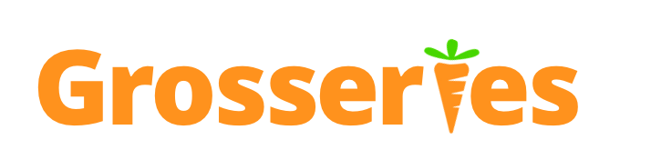

### Note: the pitch video with demo show a viewpoint far from the lake, to see changes that occur to the lake, check out the Project Media photos.

## Try it out yourself! 
**On Unity Editor - Build and Run it!: ** [https://github.com/alvinwang922/grosseries](https://github.com/alvinwang922/grosseries) Open entire repository as a Project and Build & Run from there.

or

**Upload to Oculus headset (Quest tested, others untested), via VR-Sideloader [https://headjack.io/tutorial/sideload-install-app-apk-oculus-go-quest/](https://headjack.io/tutorial/sideload-install-app-apk-oculus-go-quest/) upload the APK file to your headset and run it.

## Inspiration
Grosseries mission is to educate **everyday shoppers** about how their purchase **choices** can **impact** the environment around them. We aim to improve outcomes in **sustainability** awareness in a public desensitized from statistics, news, and even infographics.

Imagine if you are an Indonesian local, living in a rural community and making a living growing crops to feed livestock. Every year you slash and burn (set fire to peatland and forests to make new fertile soil for farming). This causes haze, pollution from burning that chokes your children and you – leading to long-term negative health impacts.

But you can’t stop this practice; decades of unsustainable practice and sustained foreign demand for certain livestock and meat products mean that this is what you need to do to survive. As you choke on smoke, you know you’re damaging your environment.

Grosseries **show** how ‘gross’ and disturbing the impact of a shopper’s actions are on the environment. It gives an experience that most city-dwellers would never encounter.

How we do so, Grosseries:

**1. Immersive VR Experience**: Designed with minimal features that would interrupt the experience, it immerses you in a Virtual Reality Experience through an Oculus Quest headset and controllers.

**2. Show over Tell**: Bombarding the public with climate change statistics and the news isn’t effective. Learn the impact of your irreversible choices as the sustainability message is conveyed without any words, numbers, or voices.

**3. Scaled and Responsive Environment Changes**: Items chosen for purchase by you cause changes to Nature around you. The real-life impact of buying one leaflet of paper is magnified to model the impact of your long-term shopper choices. #GoDigital

## What it does

**1. Immersive VR Experience**
VR is the future of marketing and engagement. Using it today is **powerful**, as it is a new medium the public is rarely exposed to. On the other hand – statistics, infographics, news media are common. And even if someone sees a shocking fact about how acres of forest fire destroyed or hear how this was the hottest recorded summer in the last 30 years – no action is taken. 
We, the public, are desensitized.

**2. Show over Tell**
Changes happen when items enter the shopping cart:
- For meat: look at the water, it recedes a bit to show how much water is inefficiently used to produce meat.
- For plastic: look at the water again, because trash is gonna wash up on shore.
- For paper: look at the trees, because they will be felled.
Rather than 

**3. Scaled and Responsive Environment Changes**
Items chosen for purchase by you cause changes to Nature around you. The real-life impact of buying one leaflet of paper is magnified to model the impact of your long-term shopper choices. #GoDigital

## How we built it
The basis of our platform is the Unity 3D development platform. We coded in C# and designed. We designed prototypes of our platform using Adobe XD in order to organize our thoughts before beginning the project itself. We integrated the Oculus Rift SDK into our Unity platform to provide the rich experience of a fully immersive environment using virtual reality.

## Challenges we ran into
Our team of an electrical engineer, a full-stack developer, a frontend/UI UX, and a backend developer – have never used Unity, Oculus SDKs, or touched VR development before.

While we considered doing a good ol' WebApp version of this idea, we knew a VR experience would be a more powerful tool in conveying the message. Thus, we dared to risk it all—to travel outside of our comfort zone—to become VR/Unity Developers within 36 hours.

Project files started in the hundreds of megabytes and reached gigabytes by the time we were finished. We used several packages that were necessary for our idea, inevitably lengthening the time it took for us to get acquainted with Unity. Only two of the four of us shared a similar time zone, which at times hindered communication and subsequent progress. For all of these reasons and more, virtual collaboration on this particular project became significantly more effortful as time progressed.

## Accomplishments that we're proud of
Over the past 36 hours, we overcame many difficulties, from our varying time zone differences to working in a completely new field. We are all super proud that within these hours, we not only accustomed ourselves to the technologies involved in developing VR applications but we created a meaningful and impactful project in this new field that pushes towards the sustainability of our beautiful planet through our daily grocery choices. In fact, it was all our first times coding in C#, so the fact that we pushed out such a cool VR application was such an accomplishment to all of us. It was also awesome how well we worked together. In addition, most of us had not talked before the start of the hackathon, but we were able to play to each other’s strengths and weaknesses throughout the 36 hours and worked so well together as a team.

## What we learned
Over the past 36 hours, we learned so much about not only the technologies required in developing a VR project, such as working in Unity in coding in C#, but also about how our daily grocery choices can impact the environment. We pursued research at the intersection of environmental sustainability and global food consumerism to learn about how certain groceries weren’t as sustainable for our planet and their replacements that were more sustainable. We also learned about some important aspects of teamwork and communication, as it was definitely not easy in the beginning figuring out what our strengths and weaknesses were in terms of this brand new field but also figuring out how to align our schedules as our time zones were very offset. However, we quickly adapted and learned how to apply our strengths and weaknesses to this new field and figure out how to work together despite the time zone differences.

## What's next for Grosseries

In ten years, when everyone has their own VR headset, we envision an environment where everyone can see how something is typically seen as mundane—grocery shopping—can affect the globe on a larger scale and in the long run. Thus, we want to eventually simulate an actual outdoor grocery store with not just more items but more specific grocery items that people shop for such as raw steaks or organic bananas rather than general items such as meats and fruits. If we were to switch to these more specific items, we would also be able to provide users with specific numbers in regards to how exactly their grocery choices are negatively impacting the environment.

In addition, it would be amazing to eventually further a multiplayer aspect of this project. We can picture Grosseries as a feature in a “Second Life”-Esque platform to further the message of sustainability. We could have multiple islands for different groups of people or even schools who could make grocery choices on their island that reflect their grocery choices in real life. People could visit each other’s islands to learn more about how others are helping sustain the planet best. In this way, people could not only learn about how their grocery choices negatively impact the environment but also playfully compete to see who’s grocery choices are sustaining the environment the best. The possibilities with a multiplayer feature are limitless, as we could host competitions or VR chat servers on Earth Day and have events similar to that to emphasize how important grocery decisions are to the sustainability of our planet.

In more technical terms, we envision our next steps to include extending our idea to augmented reality to allow for full immersion in the real world. In parallel to virtual reality, implementing augmented reality would reflect actual changes in the real world rather than a virtual one and therefore greatly aid in our illustration. In the future, when VR/AR technology becomes even more affordable and accessible, then we hope that our experience can be integrated into a greater and more general audience.
